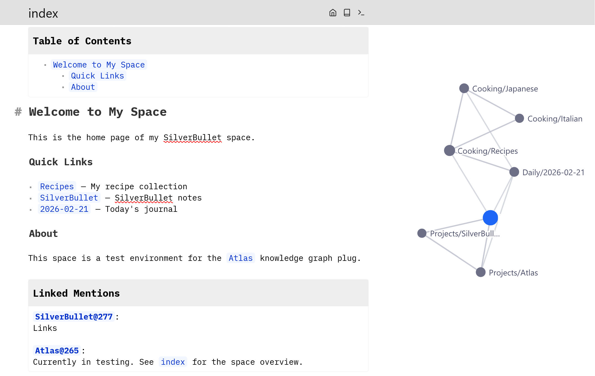
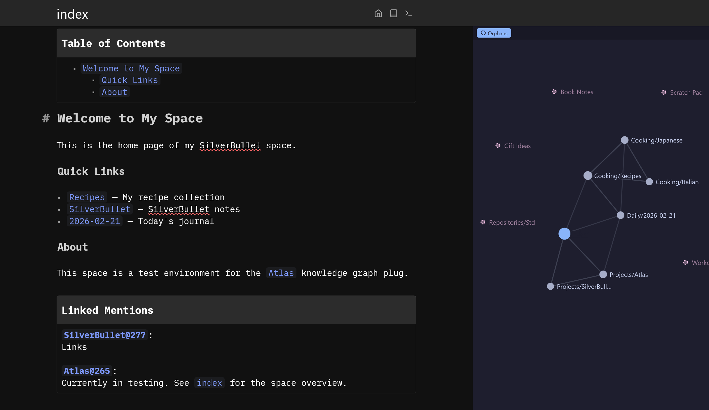

# Atlas — Graph View for SilverBullet

An interactive knowledge graph that lives in the right panel. Shows **all pages and their connections** as a force-directed D3.js graph, highlighting the current page.




## Features

- **Full graph** — shows every page and wikilink in your space (system pages filtered out)
- **Auto-updates** on page navigation — graph recenters on the current page
- **Click to navigate** — click any neighbor node to jump to that page
- **Drag nodes** — reposition nodes, simulation reheats
- **Zoom & pan** — scroll to zoom, drag background to pan
- **Hover highlighting** — hover a node to highlight its connections, dim the rest
- **Adaptive node sizing** — nodes scale with connection count
- **Dark/light mode** — follows SilverBullet's theme automatically

## Install

Run the **Library: Install** command in SilverBullet and use this URL:

```txt
https://github.com/selcux/silverbullet-atlas/blob/main/PLUG.md
```

## Usage

Run the command: **Atlas: Toggle Graph View**

This opens (or closes) the graph panel on the right side. The graph automatically updates as you navigate between pages.

## Known Issues

- **Script-generated links not shown** — Links produced dynamically by Space Lua templates (e.g. `${string.format("[[Journal/%s|Today's Journal]]", os.date("%Y-%m-%d"))}`) are not included in the graph. The SilverBullet index only tracks statically written wikilinks.

## Development

### Prerequisites

- [Deno](https://docs.deno.com/runtime/)

### Setup

1. Create a namespace folder in your space:

   ```bash
   mkdir -p ~/myspace/Library/Atlas
   ```

2. Build and copy:

   ```bash
   deno task build
   cp atlas.plug.js ~/myspace/Library/Atlas/
   ```

3. In SilverBullet: run **Plugs: Update** or reload the page.

### Architecture

```txt
Web Worker (no DOM)              Panel iframe (has DOM)
┌─────────────────────┐         ┌──────────────────────┐
│  atlas.ts            │──JSON──▶│  d3.min.js           │
│  ├─ toggleAtlas()    │         │  atlas-render.js     │
│  ├─ updateGraph()    │◀─call───│  atlas-style.css     │
│  └─ handleNavigate() │         │                      │
│                      │         │  SVG force graph     │
│  graph.ts            │         │  drag/zoom/click     │
│  └─ buildFullGraph() │         └──────────────────────┘
│        ▼             │
│  SB Index syscalls   │
└─────────────────────┘
```

- **Worker → Panel:** `editor.showPanel("rhs", ...)` injects D3 + graph data as `window.__ATLAS_DATA__` into the iframe script.
- **Panel → Worker:** The iframe calls `syscall("system.invokeFunction", "atlas.handleNavigate", pageId)` to navigate.
- **Theme:** SB sets `data-theme` on the iframe's `<html>` via `postMessage`. CSS variables activate accordingly.

### Theming

All colors are defined as CSS custom properties in `atlas-style.css`, keyed by `data-theme`:

| Variable | Purpose |
| -------- | ------- |
| `--atlas-bg` | Panel background |
| `--atlas-node-current` | Current page node |
| `--atlas-node-neighbor` | Other nodes |
| `--atlas-edge` / `--atlas-edge-highlight` | Edge default / hover |
| `--atlas-label` / `--atlas-label-current` | Label text |
| `--atlas-node-dim` / `--atlas-edge-dim` / `--atlas-label-dim` | Dimmed on hover |